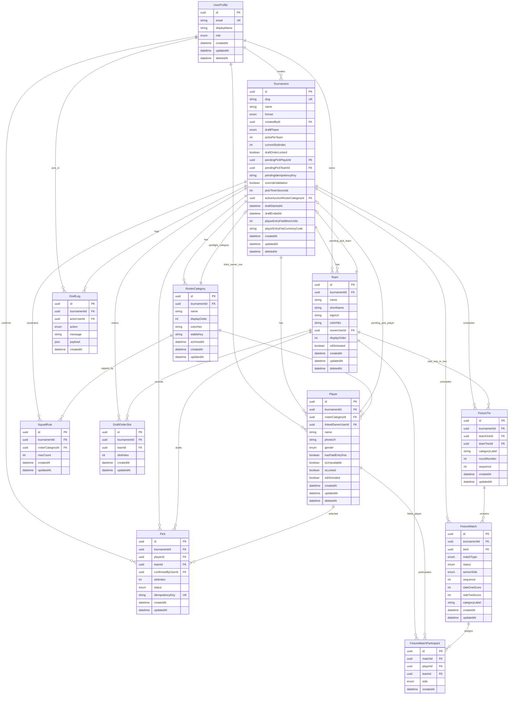

# Database Documentation

## Overview
HuliCourt uses PostgreSQL through Prisma 7. The schema is tournament-centric: nearly every business entity belongs to a `Tournament`, and draft plus fixture workflows are modeled as stateful relations around that root.

Core design choices:
- Soft delete is used for critical user-facing setup entities.
- Enums encode workflow states and eliminate many magic strings.
- Database uniqueness constraints protect draft integrity and ownership mappings.
- Fixtures and standings are derived from normalized match records rather than stored as duplicated summary tables.

## Aggregate Map
- `UserProfile`: authenticated platform identity and role record.
- `Tournament`: aggregate root for setup, draft runtime, and fixture lifecycle.
- `Team`: franchise within a tournament, optionally linked to an owner.
- `Player`: draftable or owner-linked roster row.
- `RosterCategory`: roster-group taxonomy for players and caps.
- `SquadRule`: maximum allowed roster count by category.
- `DraftOrderSlot`: persisted snake-draft order.
- `Pick`: confirmed roster acquisition event.
- `DraftLog`: append-only audit log for draft actions.
- `FixtureTie`: pairing between two teams.
- `FixtureMatch`: concrete match inside or outside a tie.
- `FixtureMatchParticipant`: player-to-match assignment with side metadata.

## Mermaid ER Diagram

## Key Relationships and Invariants

### Tournament as aggregate root
Almost every mutable domain record is scoped by `tournamentId`. This makes tenancy and lifecycle rules straightforward and keeps most queries localized.

### Ownership model
- `Team.ownerUserId` links a franchise owner account to a team.
- `Player.linkedOwnerUserId` links a profile to an owner-backed roster row.
- `@@unique([tournamentId, linkedOwnerUserId])` guarantees at most one owner-linked player row per tournament.

### Draft integrity
- `DraftOrderSlot` enforces one slot per index with `@@unique([tournamentId, slotIndex])`.
- `Pick` enforces one pick per player per tournament with `@@unique([tournamentId, playerId])`.
- `Pick.idempotencyKey` and `Tournament.pendingIdempotencyKey` reduce duplicate nomination and confirmation edge cases.
- `Tournament.pendingPickPlayerId` and `pendingPickTeamId` model the draft’s pending confirmation state without prematurely creating a confirmed `Pick`.

### Squad rules and roster taxonomy
- Every player belongs to exactly one `RosterCategory`.
- Every active category can have one cap row per tournament through `@@unique([tournamentId, rosterCategoryId])` on `SquadRule`.
- Archived categories remain in the database for integrity and history, rather than being hard deleted.

### Fixture model
- `FixtureTie` represents a team-vs-team encounter.
- `FixtureMatch` represents an individual match, either nested under a tie or standalone.
- `FixtureMatchParticipant` assigns players and sides to each match and optionally carries a `teamId` for doubles/team-based views.
- Standings are computed from completed match records, so match rows are the authoritative operational source.

## Soft Delete Policy
Soft deletes are implemented on:
- `UserProfile`
- `Tournament`
- `Team`
- `Player`

This is the right choice for the product because these records participate in historical draft and fixture flows. Deleting them physically would make audit, recovery, and downstream integrity much harder.

## Enum Domains
- Access and admission: `UserRole`
- Player metadata: `Gender`
- Draft state: `DraftPhase`
- Pick state: `PickStatus`
- Audit action: `DraftLogAction`
- Tournament format: `TournamentFormat`
- Match type and state: `FixtureMatchType`, `FixtureStatus`, `FixtureSide`

## Query and Index Notes
The schema already includes sensible indexes for the current workload:
- tournament lookup by creator and phase
- team lookup by tournament and owner
- player lookup by tournament, category, and name
- draft log lookup by tournament and created time
- fixture lookups by tournament and sequence

For the current size of the product, this is a good baseline. If the platform grows materially, the first likely follow-up would be composite indexes tuned to live snapshot assembly and owner-team roster lookups.

## Engineering Assessment
The schema is disciplined and production-friendly. It encodes important business rules directly in the database, keeps draft state explicit, and preserves integrity with soft deletes and unique constraints.

The biggest modeling compromise is that `Tournament` carries several live draft workflow fields directly on the row. That is a practical design for a single live draft per tournament, but if the product ever needs richer event sourcing, resumable draft sessions, or concurrent operational modes, a dedicated draft-session aggregate would be the next evolution.
